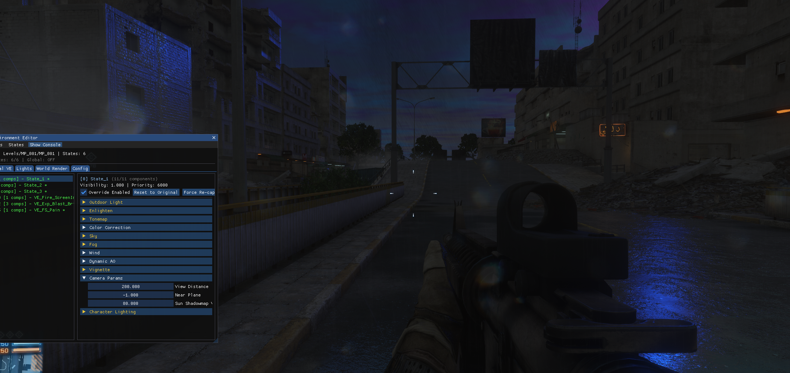
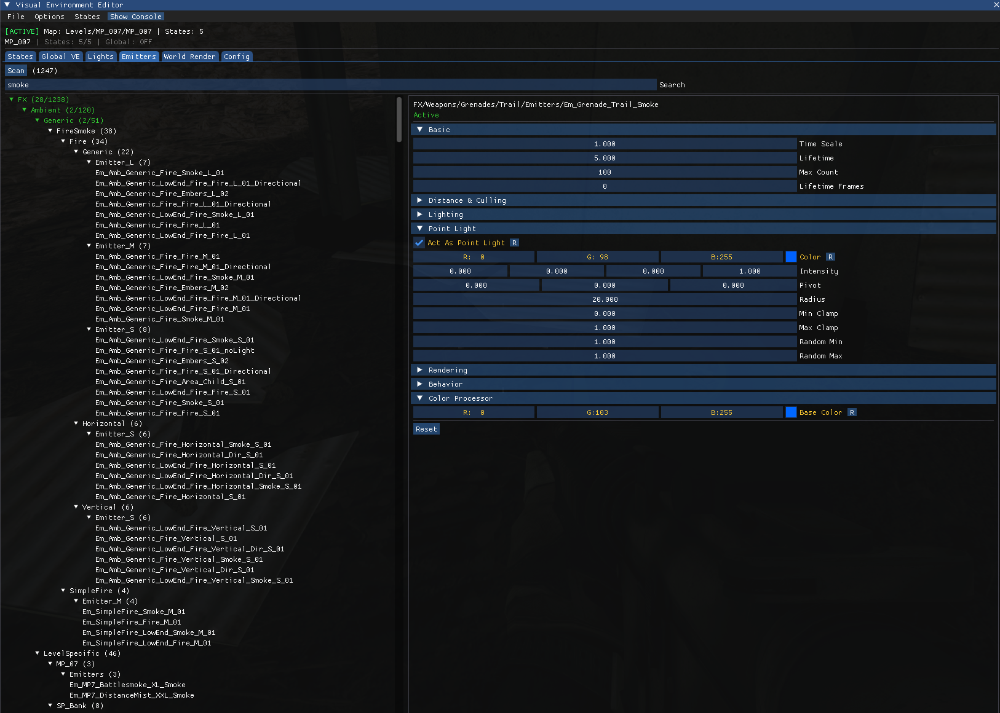
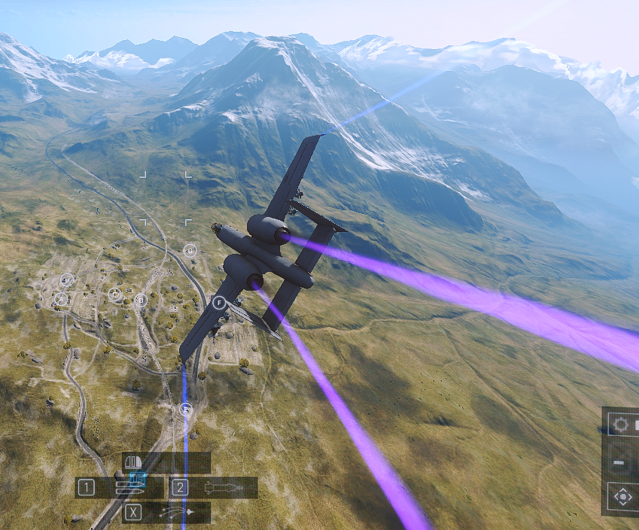
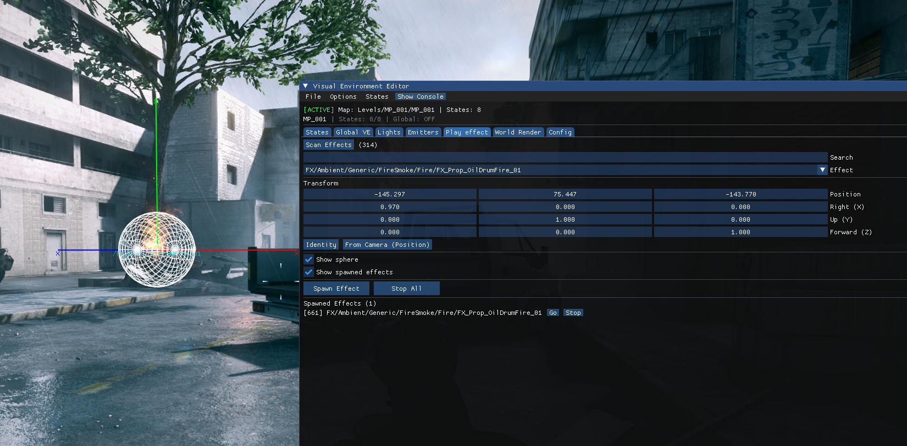

# BF Visual Editor

Runtime editor for Battlefield 3 and Battlefield 4 (Frostbite 2 / 3). It is injected into the running game and edits the live engine objects: visual environment states, world render settings, Enlighten lighting, lights, lens flares, emitters, effects, textures, materials and shaders. Nothing on disk is touched; every edit is a write into memory the engine already holds, and a per-map config replays it on the next load.

Injection into an online game is at your own risk. I am not responsible for bans.

## Building

1. Visual Studio with vcpkg integration ([guide](https://learn.microsoft.com/en-us/vcpkg/get_started/get-started-msbuild?pivots=shell-powershell)). Dependencies come from `vcpkg.json`: MinHook, ImGui (dx11 + win32 bindings), nlohmann-json, magic-enum.
2. `Release|Win32` builds the BF3 DLL (`BFVE_GAME_BF3`), `Release|x64` the BF4 DLL (`BFVE_GAME_BF4`).
3. Inject the DLL. Injecting before a level loads is best: the resource names and originals are captured while the level is being realized. Injecting mid-round works too; the editor rescans on the next map.

## Using it

- `INSERT` toggles the window. While it is open the game's cursor and typing are handed to the editor.
- Everything lives under `Documents/VisEnvEditor/`: `<map>.json` configs, `log.txt` (mirror of the console), `Dumps/`, `Textures/` (imported images the configs refer to by name) and `Enlighten/` (generated systems, calibration and probe files per map).
- The status bar shows the editor state. `ACTIVE` means the originals of the current map are captured and overrides apply; `PAUSED` means overrides are switched off in Options.
- File menu: save / load the map config, reset states, world render and lights, force a re-capture of the originals. Options: enable overrides, show original values, highlight modified fields, auto-load configs. View: the console.

### Tabs

**States** - every `VisualEnvironmentState` the manager holds, with its priority and visibility. States come and go at runtime (spawn, vehicle, dynamic), so each one is captured when it appears and edited by identity, not by index. Each component (sky, fog, tonemap, color correction, enlighten, ...) can be overridden per state, reset to the captured original, or forced. The States menu enables or disables every override at once.

**Global VE** - the blended `VisualEnvironment` the renderer actually consumes, editable as a whole. Coarser than per-state edits, useful for a quick look. Also here:
- *Sun*: an own color and size for the sun disc (the sky normally draws it as sun light color x sky sun scale), and level-placed sun flares that follow the sun when it is rotated.
- *Night preset*: the Zavod: Graveyard Shift light colors applied to any map, with its sky, envmaps and clouds scaled down.

**World Render** - `WorldRenderSettings`: lighting, shadows, reflections, motion blur, AO, sky, decals, debug visualisations, viewport and quality. Captured on first sight, reset to original at any time.

**Lights** - every placed and spawned `LocalLightEntity`, named after the blueprint or prefab it came from and grouped by shared data (N placements of the same lamp are one entry; edits hit all of them). Per light:
- light values (point / spot, color, intensity, radius, cone, shadows, specular, enlighten) and the projected texture (gobo);
- the halo: which lens flare shader each element uses (a palette loaded from the shader database), element sizes, halo textures, private copies per light;
- the lamp: the meshes placed with the light, their materials and textures, the glow color when the material drives one;
- the effect placed with it.
New point, sphere and spot lights can be spawned at the camera or where you aim, with a preview of the position first, optionally as Enlighten lights so the solver bounces them.
An engine-drawn overlay marks lights in the world (labels, distance, occlusion), draws placed mesh boxes and LOD0 wireframes, and casts an aim ray from the crosshair with a GPU surface pick. Middle mouse opens the light under the crosshair.

**Emitters** - every emitter template the level realized, in a tree by asset path. Basic, behaviour, rendering, lighting, point light and culling values are live; the processor chain (the BF3-style node graph: spawn, color, size, velocity, shader parameters, evaluators) is shown as nodes and edited in place. A debug overlay marks live emitter entities.

**Effects** - the effect blueprints loaded in the level. Spawn any of them at the camera or a position, stop them, list what was spawned.

**Textures** - four sub-tabs:
- *Textures*: the catalogue of loaded textures (streamed table plus every `TextureAsset` the resource manager knows), thumbnails, search, dimensions and formats. Streaming controls: load / unload on demand, load-all, pool size override. A texture can be replaced everywhere it is bound, tinted, sharpened, upscaled (Lanczos), exported as PNG or DDS, or replaced by an imported image. Private copies break sharing for one slot.
- *Materials*: every realized material (`MeshVariationSet` -> `SurfaceShaderInstance` -> `ShaderParameterBlock`), by mesh and variation name. Vector parameters as colors or numbers, texture slots with a picker, and the constants the compiled shader reads but the material never declared: those can be added, which re-creates the block with the extra slot. Might be handy to edit shader params quickly under something.
- *Meshes*: placed meshes near the crosshair or matching a name, their boxes, subsets and wireframes, and the textures each material binds.
- *Shaders*: the surface under the crosshair, its pixel shader programs, the textures they sample, and their literal constants. Bright literals (an emissive baked into the graph) can be patched in the bytecode and held across rebuilds.

**Enlighten** - the precomputed global illumination: the lightmap atlas on static geometry and the light probes that light props and players. Most maps ship only a baked atlas; Locker, Naval and Tremors ship solver data and relight live.
- *Runtime*: every `EnlightenRuntimeSettings` value (solver, input lighting, outputs, probes, cube maps, debug draw), and a kick that makes the solver re-solve everything.
- *Relight*: on maps with only a baked atlas, the atlas is relit from your VE edits: the sky colors scale the part of each texel that sees the sky, sun color x sun scale and bounce the rest. Night, sunset or a different sky then show up indoors and in shadow, not only on the sky. The level's probes follow the same ratio. Needs no generation and works on every map with a baked atlas.
- *Lightmap look*: keep the shipped color and change only brightness, saturation, tint, and the strength of the sky and sun / bounce parts.
- *Engine solver*: lets the engine solve Enlighten live from the VE on any map that has systems, shipped or generated; live probes follow the solved lightmap.
- *Generated systems* (BF4, BF3 experimental): builds Enlighten systems for a static map from its rasterized geometry, writes them as `<map>_generated.edb` and applies them live, so the engine solves maps that never shipped solver data. A calibration pass matches them to the shipped atlas.
- *Texel inspector*: the texel under the crosshair with its shipped, relit or solved value, a lightmap overlay in the world, the atlas view and, for generated systems, the rays each texel cast.
All options are saved in the map config.

**Camera** - a free camera on top of the game's render view: toggle key, WASD, Space / C up and down, Shift for speed, FOV override, invert pitch, hide HUD, latched or hold-to-fly.

**Config** - save / load per map, named custom configs, delete, export and import a state through the clipboard, auto-load on map load and auto-save on unload.

## How it works

`hooks/` installs MinHook hooks on the engine: the visual environment manager update (the editor's tick on the game thread), message dispatch (level loaded), `ClientGameContext::unloadLevel` (everything is cleared before the engine frees the level), entity constructors and destructors (lights, emitters, VE entities), `DxTexture` create / release (texture edits follow the engine's own rebuilds), the shader parameter block setters (held edits win over the game's writes), the lens flare shader rebuild, the sky draw (own sun disc), and on the Enlighten side the database constructor and loader (generated systems) and the solver's output conversion (calibration). Present is hooked for ImGui and the GPU pick, and the context's shader resource binds for the relit lightmap, which replaces the level's own at bind time so every mesh gets it.

`SDK/` holds the runtime layouts in reclass style with the source function noted, `SDK/offsets.h` every address, and `SDK_bf3/` `SDK_bf4/` the reflection dumps. Reads and calls into the engine are direct; lifetime is handled by the hooks and by pruning against the engine's own lists, not by guards.

`editor/` is one module per tab. Component handling in the VE code uses the `VE_COMPONENTS` macro list so a component added once propagates to capture, UI and serialization. One editor-wide lock covers the render thread, the update thread and the entity hooks.

## Limits

- A parameter can only be added when the compiled shader reads it; the Materials tab lists exactly those. Anything baked into the graph as a literal is reached through the Shaders tab patch, not a parameter.
- Textures can only be replaced with textures the engine has loaded, or with images imported through the editor. Streaming decides when a texture is resident.
- Relight rescales the baked light; it cannot move shadows or the sun direction. That needs generated systems and the engine solver.
- Generated systems are built per map and are rougher than DICE's bakes; calibration fits them to the shipped lighting. On BF3 they are experimental.

## Future Frostbite games

I have done a very experimental 2025 Frostbite 3 editor. Some of the logic still can be referenced, although manager is a lot different now.
See [bf6 visual editor](https://github.com/Bartis1313/bf6-visual-editor).

## Previews

<table>
  <tr>
    <td width="50%"> <b>States</b> - Grand Bazaar (BF3) turned to night with per-state VE overrides</td>
    <td width="50%"> <b>Global VE</b> - sky colors edited live (BF4)</td>
  </tr>
  <tr>
    <td width="50%"> <b>Emitters</b> - an emitter's point light and color processor, Caspian Border (BF3)</td>
    <td width="50%"> <b>Emitters</b> - jet flare trails recolored (BF4)</td>
  </tr>
  <tr>
    <td colspan="2"> <b>Effects</b> - an effect spawned at a chosen transform, Grand Bazaar (BF3)</td>
  </tr>
</table>

### Videos

<table>
  <tr>
    <td width="50%"> <b>Current version</b></td>
    <td width="50%"> <b>First version</b></td>
  </tr>
</table>
